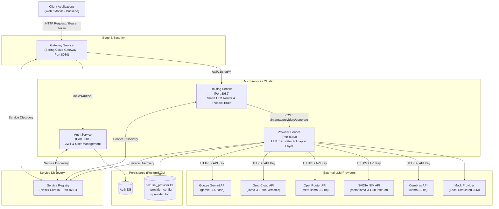
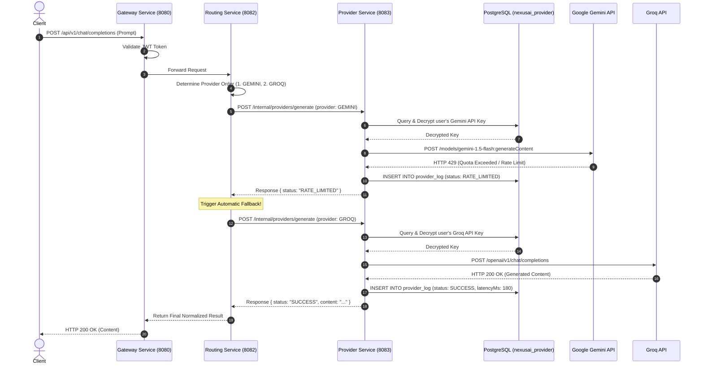

# NexusAI Gateway – System Architecture Document

## 1. Executive Summary

**NexusAI Gateway** is a distributed, high-performance **Spring Boot Microservices Platform** that provides a unified, resilient API interface for interacting with multiple Large Language Model (LLM) providers. 

Instead of client applications connecting directly to heterogeneous AI vendor APIs (Google Gemini, Groq, OpenRouter, NVIDIA NIM, Cerebras), all requests are routed through the **NexusAI Gateway**. If a provider encounters rate limits (HTTP 429), timeouts, or service outages, the system automatically falls back to an alternate configured provider with zero manual intervention.

---

## 2. Core Problem & Solution

```
[ Traditional Approach ]
Client App ───> Google Gemini API ───> HTTP 429 (Rate Limit) ───> ❌ Application Crash / Downtime

[ NexusAI Gateway Approach ]
Client App ───> NexusAI Gateway ───> Google Gemini ───> 429 (Rate Limit Detected)
                                          │
                                          └───> Auto-Fallback to Groq ───> ✅ Success (Returned to Client)
```

---

## 3. High-Level System Architecture Diagram



---

## 4. Microservices Breakdown

| Microservice | Technology Stack | Port | Primary Responsibilities |
| :--- | :--- | :--- | :--- |
| **`service-registry`** | Spring Cloud Netflix Eureka | `8761` | Dynamic service registration, heartbeat discovery, and load balancing lookup. |
| **`gateway-service`** | Spring Cloud Gateway | `8080` | Public API entrypoint, edge routing, JWT validation, global CORS, and rate limiting. |
| **`auth-service`** | Spring Boot, Spring Security, JWT, PostgreSQL | `8081` | User registration, login, token issuance, and tenant access control. |
| **`routing-service`** | Spring Boot, WebClient | `8082` | **Orchestration Brain**: Decides which provider to call first based on priority/budget, catches normalized errors, and triggers sequential fallbacks. |
| **`provider-service`** | Spring Boot, WebFlux, JPA, PostgreSQL | `8083` | **Translator & Adapter**: Decrypts user API keys, calls external LLM APIs via WebClient, standardizes responses/errors, and logs audit metrics. |

---

## 5. Provider Service Deep Dive (Translator Architecture)

The **Provider Service** isolates all vendor-specific protocols and models from the rest of the application using the **Strategy Design Pattern**.

### 5.1 Provider Strategy Pattern
```
                       ┌───────────────────────────────┐
                       │     «interface» LlmProvider   │
                       ├───────────────────────────────┤
                       │ + getProviderType()           │
                       │ + generate(request, apiKey)   │
                       └───────────────▲───────────────┘
                                       │
        ┌──────────────┬───────────────┼───────────────┬──────────────┬──────────────┐
        │              │               │               │              │              │
┌───────┴──────┐┌──────┴──────┐┌───────┴──────┐┌───────┴──────┐┌──────┴──────┐┌──────┴──────┐
│GeminiProvider││ GroqProvider││OpenRouterProv││NvidiaProvider││CerebrasProv ││ MockProvider │
└──────────────┘└─────────────┘└──────────────┘└──────────────┘└─────────────┘└─────────────┘
```

### 5.2 Internal REST Contract (`POST /internal/providers/generate`)

#### Request Contract (`GenerateRequestDto`):
```json
{
  "requestId": "req-987654",
  "userId": "user-101",
  "provider": "GEMINI",
  "model": "gemini-1.5-flash",
  "prompt": "Explain Quantum Computing in 2 sentences.",
  "maxTokens": 500,
  "temperature": 0.7
}
```

#### Standardized Response Contract (`GenerateResponseDto`):
```json
{
  "requestId": "req-987654",
  "provider": "GEMINI",
  "model": "gemini-1.5-flash",
  "content": "Quantum computing uses qubits...",
  "status": "SUCCESS",
  "latencyMs": 342,
  "tokensUsed": 38,
  "errorMessage": null
}
```

### 5.3 Normalized Status Values (`ProviderStatus`)
Every provider response (success or failure) is mapped into standard status codes so the **Routing Service** never parses raw vendor JSON or error strings:
- **`SUCCESS`**: Prompt executed successfully.
- **`RATE_LIMITED`**: Vendor returned HTTP 429 (triggers immediate automatic failover).
- **`INVALID_API_KEY`**: Vendor returned HTTP 400 / 401 / 403.
- **`TIMEOUT`**: Socket or connection read timeout (> 30 seconds).
- **`PROVIDER_DOWN`**: Vendor returned HTTP 5xx server error.
- **`UNKNOWN_ERROR`**: Unhandled edge case or parsing issue.

---

## 6. End-to-End Request & Fallback Flow



---

## 7. Database Schema (PostgreSQL `nexusai_provider`)

### 7.1 `provider_config` Table (User API Key Storage)
```sql
CREATE TABLE provider_config (
    id BIGSERIAL PRIMARY KEY,
    user_id VARCHAR(255) NOT NULL,
    provider VARCHAR(50) NOT NULL,
    api_key_encrypted VARCHAR(1000) NOT NULL,
    enabled BOOLEAN DEFAULT TRUE NOT NULL,
    priority INTEGER DEFAULT 1,
    created_at TIMESTAMP NOT NULL,
    updated_at TIMESTAMP,
    CONSTRAINT uq_user_provider UNIQUE (user_id, provider)
);
```

### 7.2 `provider_log` Table (Audit & Observability)
```sql
CREATE TABLE provider_log (
    id BIGSERIAL PRIMARY KEY,
    request_id VARCHAR(255) NOT NULL,
    user_id VARCHAR(255) NOT NULL,
    provider VARCHAR(50) NOT NULL,
    model VARCHAR(100),
    status VARCHAR(50) NOT NULL,
    latency_ms BIGINT,
    tokens_used INTEGER,
    error_message VARCHAR(2000),
    created_at TIMESTAMP NOT NULL
);
```

---

## 8. Technology Stack & Design Highlights

* **Language**: Java 17
* **Framework**: Spring Boot 3.x / 4.x
* **Reactive HTTP Client**: Spring WebFlux (`WebClient`) for non-blocking HTTP external communication.
* **Security**: Base64 / AES encryption on user API keys at rest in PostgreSQL.
* **Boilerplate Reduction**: Lombok (`@Data`, `@Builder`, `@RequiredArgsConstructor`).
* **Resilience**: Client never changes API keys or providers manually; the microservices layer handles fallback orchestration dynamically.
